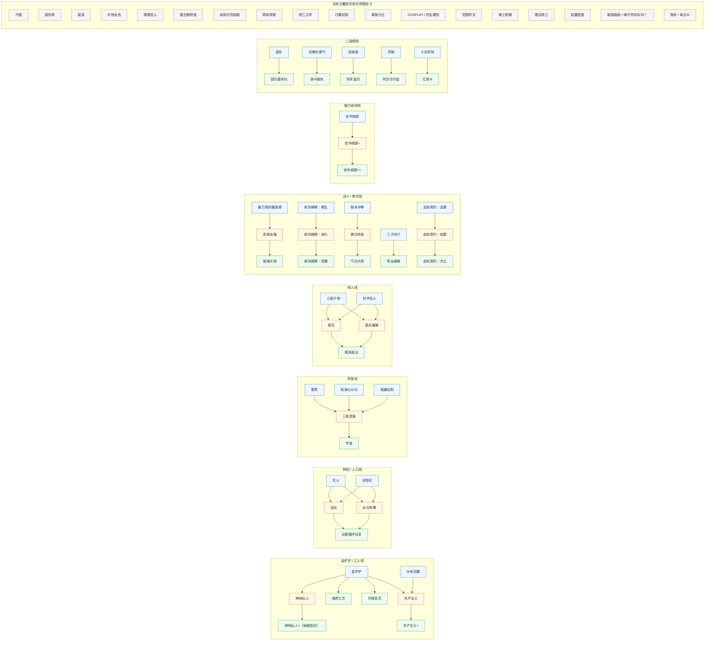

# 海克斯依赖树

排除文明 / 特色区域限定升级卡。`A / B --> C` 表示 `C` 需要 `A` 或 `B` 其一；标注“秘密结社”表示还需要该模式开启。

```mermaid
flowchart LR
    classDef root fill:#eef7ff,stroke:#2f6fa3,color:#123047
    classDef mid fill:#fff7e6,stroke:#b87516,color:#3b2400
    classDef terminal fill:#eefaf0,stroke:#3a8f4b,color:#12351a
    classDef special fill:#f6efff,stroke:#7b4bb3,color:#27133f
    classDef lone fill:#f5f5f5,stroke:#888,color:#222

    subgraph BuilderLine["金铲铲 / 工人线"]
        Golden["金铲铲"]:::root
        Farm["种地仙人"]:::mid
        FarmPlus["种地仙人+（秘密结社）"]:::terminal
        CityState["城邦工艺"]:::terminal
        Branch["朽枝复花"]:::terminal
        Communism["共产主义"]:::mid
        CommunismPlus["共产主义+"]:::terminal
        Earth["大地苏醒"]:::root

        Golden --> Farm --> FarmPlus
        Golden --> CityState
        Golden --> Branch
        Golden --> Communism --> CommunismPlus
        Earth --> Communism
    end

    subgraph GrowthLine["种田 / 人口线"]
        Slow["文火"]:::root
        Genesis["创世纪"]:::root
        Grow["滋长"]:::mid
        Bread["太仓有粟"]:::mid
        Loop["无限循环往复"]:::terminal

        Slow --> Grow
        Genesis --> Grow
        Slow --> Bread
        Genesis --> Bread
        Grow --> Loop
        Bread --> Loop
    end

    subgraph TradeLine["贸易线"]
        Sell["鬻贾"]:::root
        Sextant["航海七分仪"]:::root
        Duff["窖藏旧酎"]:::root
        Triangle["三角贸易"]:::mid
        GoldRend["夺金"]:::terminal

        Sell --> Triangle
        Sextant --> Triangle
        Duff --> Triangle
        Triangle --> GoldRend
    end

    subgraph GreatPersonLine["伟人线"]
        Mind["心胜于物"]:::root
        Mad["科学狂人"]:::root
        Orb["相生"]:::mid
        Star["星光璀璨"]:::mid
        Capital["精英政治"]:::terminal

        Mind --> Orb
        Mad --> Orb
        Mind --> Star
        Mad --> Star
        Orb --> Capital
        Star --> Capital
    end

    subgraph CombatLines["战斗 / 单位线"]
        Scope["最万用的瞄准镜"]:::root
        Hammer["连拨击锤"]:::mid
        Cannon["玻璃大炮"]:::terminal
        WarFeed["弑杀蜂群：增生"]:::root
        Hunter["弑杀蜂群：进化"]:::mid
        Prestige["弑杀蜂群：至臻"]:::terminal
        Punch["秘术冲拳"]:::root
        Buddhist["佛功传承"]:::mid
        Qigong["气功大师"]:::terminal
        Cerberus["三犬司门"]:::root
        Bush["草丛插眼"]:::terminal
        Bloodline["血色契约：血裔"]:::root
        Count["血色契约：伯爵"]:::mid
        Duke["血色契约：大公"]:::terminal

        Scope --> Hammer --> Cannon
        WarFeed --> Hunter --> Prestige
        Punch --> Buddhist --> Qigong
        Cerberus --> Bush
        Bloodline --> Count --> Duke
    end

    subgraph TerrainLine["魅力地块线"]
        Shangri["世外桃源"]:::root
        ShangriPlus["世外桃源+"]:::mid
        ShangriPP["世外桃源++"]:::terminal

        Shangri --> ShangriPlus --> ShangriPP
    end

    subgraph ShortLines["二级短线"]
        Primitive["返朴"]:::root --> Basics["回归基本功"]:::terminal
        Colossus["巨像的勇气"]:::root --> Accident["误中副车"]:::terminal
        Scribe["急就章"]:::root --> Knife["将军金印"]:::terminal
        Speed["风驰"]:::root --> Waltz["利刃华尔兹"]:::terminal
        Clown["小丑学院"]:::root --> Eureka["尤里卡"]:::terminal
    end

    subgraph Standalone["当前无叠层的非文明限定卡"]
        Comp["代偿"]:::lone
        Core["超负荷"]:::lone
        Cosplay["裂变"]:::lone
        Double["手快全选"]:::lone
        Dice["掷骰狂人"]:::lone
        Protein["蛋白粉奶昔"]:::lone
        Mikael["米凯尔的祝福"]:::lone
        Infernal["炼狱导管"]:::lone
        Death["死亡之环"]:::lone
        Mobile["行幄初张"]:::lone
        King["尊我为王"]:::lone
        Mimic["COSPLAY / 仿生模仿"]:::lone
        Land["狂野符文"]:::lone
        Pig["掌上明猪"]:::lone
        Bean["憨豆特工"]:::lone
        Heli["铝翼坠毁"]:::lone
        Band["能陪我组一辈子的乐队吗？"]:::lone
        Singularity["鬼斧 / 奇点AI"]:::lone
    end
```
